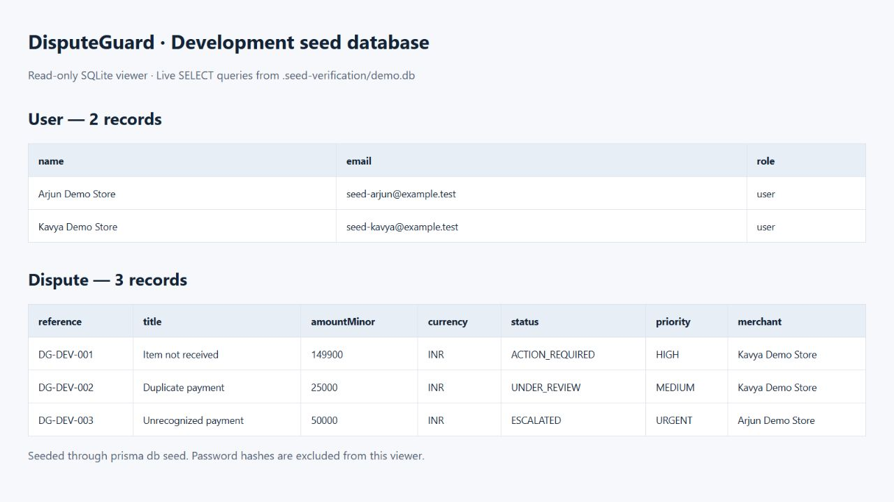

# Database Seeding for Development

## Requirement mapping

- `frontend/prisma/seed.ts`: seeds two User records and three related Dispute records.
- `frontend/package.json`: `prisma.seed` is `node --import tsx prisma/seed.ts`.
- `frontend/prisma7.config.ts`: reads that entry into `migrations.seed`, which
  Prisma 7 actually executes. There is a single source for the command.
- `prisma db seed` was executed against a separate SQLite database after
  `prisma migrate deploy`; it reported two users and three disputes ensured.
- Both models use upsert by unique email/reference with empty updates.
- Screenshot below comes from live SELECT queries in the read-only SQLite viewer
  in `frontend/scripts/seed-viewer.mjs`, not a mock data table. Prisma Studio in
  this installed version rejected the file URL, so the local viewer was used.



## Reproduce (from frontend, Node 24)

```sh
pnpm install --frozen-lockfile
pnpm prisma:generate
```

Use a separate local SQLite file. Example PowerShell:

```powershell
New-Item -ItemType Directory -Force .seed-verification | Out-Null
$env:DATABASE_URL = 'file:./.seed-verification/demo.db'
node -e "const {DatabaseSync}=require('node:sqlite');new DatabaseSync('.seed-verification/demo.db').close()"
pnpm db:deploy
pnpm db:seed
pnpm db:seed
node scripts/seed-viewer.mjs
```

Open http://127.0.0.1:51234 to inspect both models. The viewer binds to loopback,
opens the database read-only, and excludes password hashes. Stop with Ctrl+C.
Do not run the initialization command on an unrelated existing database.
Explicit file initialization avoids the observed Windows Prisma nested-file
creation failure. No database server is installed. The local DB is Git-ignored.

## Verification — 2026-09-10

`node --import tsx --test tests/development-seed.test.ts`: passed. The integration
test invokes real Prisma migration and seeding subprocesses. It checks initial
counts, valid merchant relationships, hashed passwords, user-only roles, stable
IDs, no duplicates on repeat, preserved dispute edits and passwords, preserved
unrelated records, and the production refusal. Its unique test DB is cleaned up.
Prisma Client generation and focused lint passed. Full-repository TypeScript
checking has existing errors in `app/api/disputes/route.ts` and
`scripts/test-relation-query.ts`, which import PrismaClient from @prisma/client
instead of this project's custom generated output. Those unrelated files were
not changed. No full application build is claimed.

The current main branch changed to SQLite. This slice adds the matching libSQL
adapter and required generated-client runtime dependency, and updates the shared
client to match the datasource. It does not change the schema or migration SQL.
Three empty untracked migration folders left by a branch switch were removed;
no migration files were removed or rewritten.

## Strategy and tradeoff

The seed uses one transaction and upserts by reserved example.test emails and
DG-DEV references. Empty update objects preserve local edits rather than resetting
data on each run. Consequently, changing fixtures later does not overwrite older
seed rows. Use a fresh test database when an exact baseline is required.

User passwords are random and hashed with bcrypt; no shared working password or
admin account is introduced. For login demos use the normal registration flow.
The date is fixed for reproducibility, so it will eventually be in the past.
Local file URLs only are accepted, and NODE_ENV=production is rejected; operators
must still select the intended development database. No deleteMany or reset is used.

## Video outline (3–5 minutes)

1. Explain why development and CI need repeatable fictional records.
2. Show `prisma/seed.ts`, its User/Dispute upserts and their create branches.
   Plain create calls duplicate or violate unique keys on rerun; upsert satisfies
   the assignment's idempotency requirement.
3. Show package.json prisma.seed and the Prisma 7 migrations.seed mapping.
4. Run prisma db seed twice and show the DB viewer with two users/three disputes.
5. Explain empty updates, transaction behavior, production guard and isolated tests.

Record and upload the video yourself to Google Drive, enable anyone-with-link
viewing, and test the link privately. Video recording/upload is not completed.
