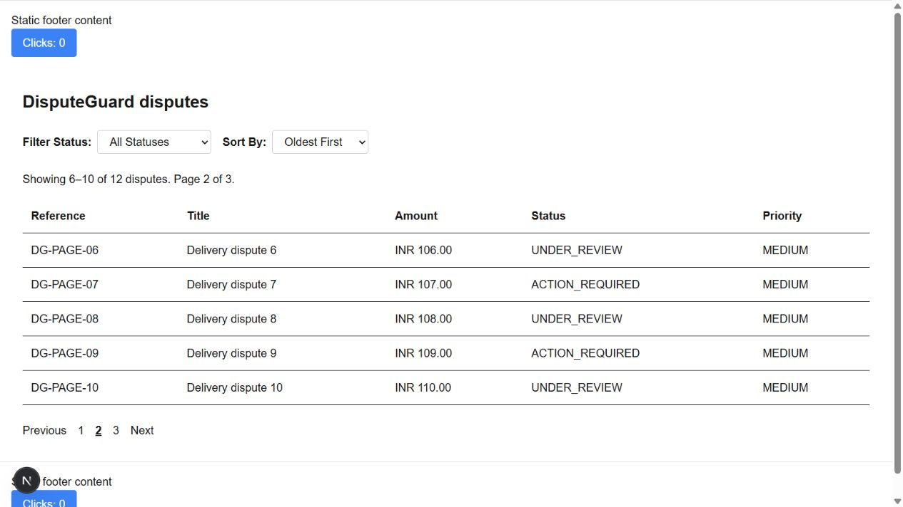

# Dispute pagination — implementation and verification

## Requirements

1. `/disputes` displays five records per page using offset pagination.
2. `?page=2&sort=asc&status=ACTION_REQUIRED` stores navigation/filter state in the URL.
3. Previous, Next and page links update records; filters reset page to 1.
4. `frontend/lib/dispute-pagination.ts` executes Prisma `skip: (page - 1) * 5`
   and `take: 5`, with the same status condition for count and records.
5. This document and `pagination-pr.md` explain the selected strategy and limits.

The query orders by createdAt, then unique ID in the same direction. This gives
deterministic results even with tied timestamps. Count and page reads share a
transaction. Invalid, negative, fractional, repeated or unsafe page values use
page 1; pages beyond the last are clamped and redirected to the actual page URL.
Empty results show zero records and disabled previous/next controls. Status input
is checked against the generated enum instead of cast through any.

The existing URL-filter page conflicted with a route handler at the same path.
Removed that duplicate `/disputes/route.ts` so Next.js can serve the page. The
existing `/api/disputes` handler remains; its unrelated import error is not fixed
by this slice. The list retains its existing public access behavior. It is not a
merchant authorization boundary; deploy real account data only with appropriate
server-side access controls. Demo verification uses fictional data only.

## Why offset

Offset fits a small review table where a user needs numbered pages, a total count
and direct jumps. Cursor pagination is better suited to deep sequential browsing
or load-more experiences. Offset cost grows with skipped rows, and inserts/deletes
between requests can shift results despite a stable sort. Each request is consistent,
but this does not promise a frozen dataset across separate page requests.

This assignment allows either strategy; only offset is implemented. A conceptual
cursor alternative, ordered by its unique key, would be:

```ts
await prisma.dispute.findMany({
  orderBy: { id: 'asc' },
  cursor: { id: lastSeenId },
  skip: 1, // exclude the cursor record
  take: 5,
});
```

That uses a different ordering from our timestamp-sorted UI. An indexed keyset
design can avoid scanning a large offset, but inspect the query plan and indexing;
using a cursor is not a universal performance guarantee. Numbered pages replace
the visible slice; load-more normally appends results and tracks the last cursor.
Do not describe load-more or cursor UI as implemented in this PR.

Reference: [Prisma pagination documentation](https://www.prisma.io/docs/orm/v7/prisma-client/queries/pagination).

## Run the isolated demo

From frontend with Node 24 and installed dependencies:

```powershell
pnpm test:pagination
pnpm demo:pagination
$env:DATABASE_URL = 'file:./.seed-verification/pagination.db'
node node_modules/next/dist/bin/next dev --port 3005
```

Open `http://localhost:3005/disputes?page=1&sort=asc`. The preparation command
creates 12 fictional disputes in a separate ignored SQLite file and refuses to
overwrite an existing demo file. On subsequent runs reuse the existing file.
No migration is applied to an existing user database and no dependencies were
installed for this assignment. Tests create and clean up a distinct temporary file.

## Observed results — 2026-09-14

- Two automated tests passed: URL normalization/link preservation and real Prisma
  SQLite pagination covering 5/5/2 slices, tied timestamps, no duplicate IDs,
  reverse order, filtered count, last-page metadata, out-of-range and empty results.
- Focused ESLint on all changed TypeScript files passed.
- Browser: page 1 shows DG-PAGE-01–05; Next changes URL to page=2 and shows
  DG-PAGE-06–10; Next shows 11–12 with no Next link; browser Back restores page 2.
- Changing status on page 2 resets to page=1, shows five of six matching records,
  and retains sort. Refresh preserves that URL, selection and result set.
- The screenshot below was captured from the running Next.js page.
- Full-repo tsc still reports existing PrismaClient import errors in
  `app/api/disputes/route.ts` and `scripts/test-relation-query.ts`. No full build
  success is claimed. Generated stale route types refreshed during next dev.



## Video outline (3–5 minutes)

1. Explain offset versus cursor and why this small table uses offset.
2. Show skip/take, status count, stable ordering and returned page metadata.
3. Describe the cursor example above, skip:1 and key/index requirements.
4. Demonstrate page numbers, Next, Back and filtering. Explain that load-more
   would append results, whereas this UI replaces the current page.
5. Explain offset scanning costs, concurrent changes and indexed cursor scaling.

Recording and Google Drive upload remain user submission steps. Upload your
screen-share, enable anyone-with-link viewing and verify it in a private browser.
